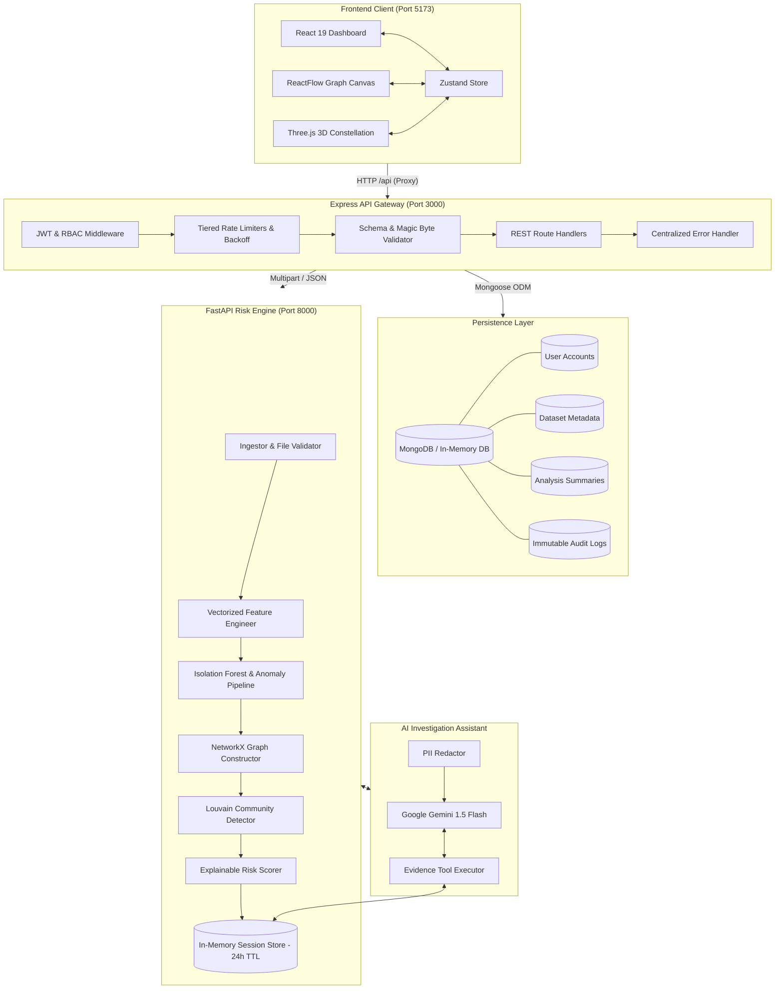
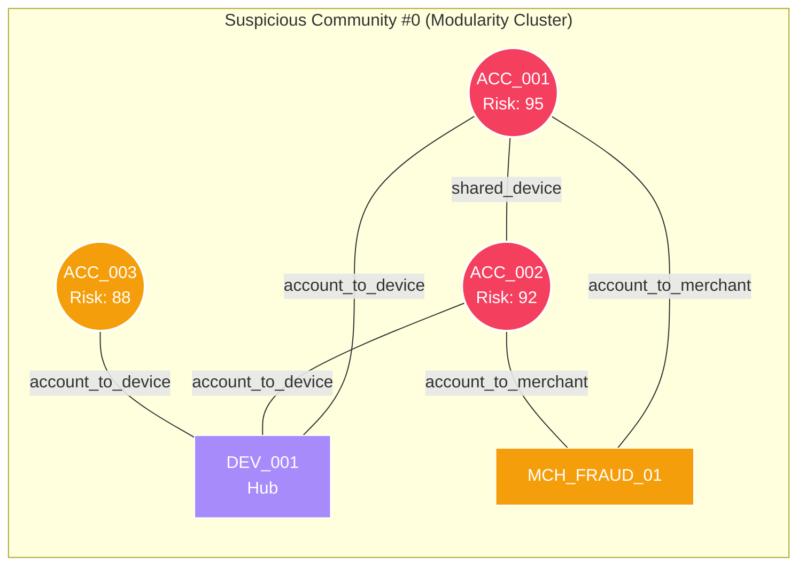
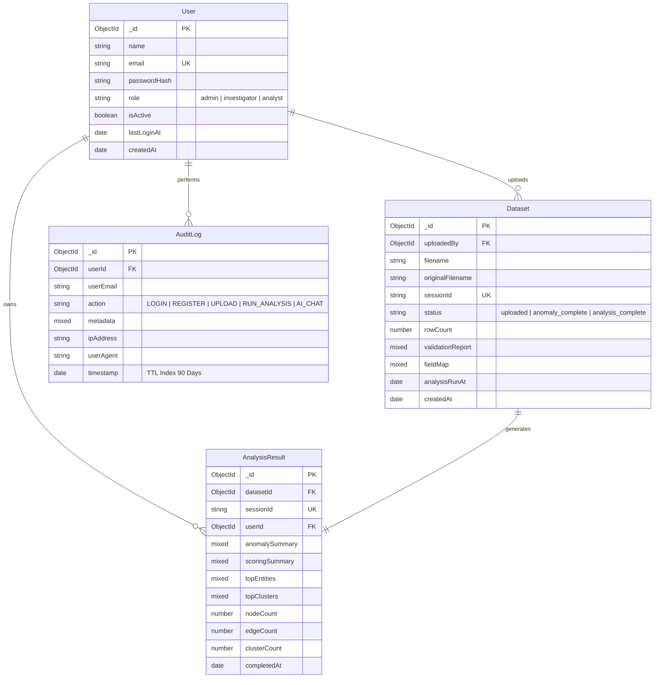

# TraceX

### AI-Powered Financial Fraud Network Detection & Investigation Platform

[](https://fastapi.tiangolo.com)
[](https://expressjs.com)
[](https://react.dev)
[](https://vitejs.dev)
[](https://tailwindcss.com)
[](https://networkx.org)
[](https://scikit-learn.org)
[](https://threejs.org)
[](https://www.mongodb.com)
[](https://ai.google.dev)

> **TraceX** transforms static transaction logs into dynamic, explainable intelligence graphs. It combines unsupervised anomaly detection (Isolation Forest & statistical velocity signals), graph community detection (Louvain algorithm), and an evidence-grounded AI copilot to uncover coordinated fraud rings, shared device syndicates, and money laundering funnels.

---

## Table of Contents

- [1. Project Overview](#1-project-overview)
- [2. Problem Statement](#2-problem-statement)
- [3. Our Solution](#3-our-solution)
- [4. Key Features](#4-key-features)
- [5. Technology Stack](#5-technology-stack)
- [6. System Architecture](#6-system-architecture)
- [7. How TraceX Works](#7-how-tracex-works)
- [8. Machine Learning Pipeline](#8-machine-learning-pipeline)
- [9. Graph Theory & Network Analysis](#9-graph-theory--network-analysis)
- [10. Visualizations & Analytical Charts](#10-visualizations--analytical-charts)
- [11. Dashboard & User Interface](#11-dashboard--user-interface)
- [12. UI Screenshots & Previews](#12-ui-screenshots--previews)
- [13. Database Design](#14-database-design)
- [14. Project Structure](#15-project-structure)
- [15. Example Investigation Workflow](#16-example-investigation-workflow)
- [16. Performance & Scalability](#17-performance--scalability)
- [17. Security & Hardening](#18-security--hardening)
- [18. Advantages](#19-advantages)
- [19. Limitations](#20-limitations)
- [20. Future Scope](#21-future-scope)
- [21. Why TraceX?](#22-why-tracex)
- [22. Explain TraceX in 60 Seconds](#23-explain-tracex-in-60-seconds)
- [23. Demo Script](#24-demo-script)
- [24. License](#25-license)

---

## 1. Project Overview

Financial crime has evolved from isolated bad actors committing single-card theft to sophisticated, distributed fraud syndicates operating across multiple accounts, shared devices, IP subnets, and compromised merchant gateways. 

Traditional rule-based fraud detection systems (like static velocity checks or per-transaction thresholds) fail because **each individual transaction is engineered to appear normal**. When bad actors disperse funds across dozens of mule accounts and execute micro-transactions below reporting thresholds, point-in-time checks remain blind.

**TraceX** solves this by unifying:
1. **Unsupervised Anomaly Scoring**: Evaluates multivariate deviation and velocity anomalies per transaction.
2. **Heterogeneous Graph Construction**: Maps relational connections between Accounts, Hardware Devices, Merchants, and Geo-Locations.
3. **Graph Community Partitioning**: Detects tightly connected subgraphs and criminal syndicates using modularity optimization.
4. **Explainable Risk Scoring**: Breaks down entity and network risk into clear, audible signals (0–100 scale).
5. **Evidence-Grounded AI Copilot**: Enables investigators to query evidence interactively with LLM tool-calling.

---

## 2. Problem Statement

Modern financial fraud is decentralized and coordinated:
- **Mule Networks & Synthetic Identities**: Fraud rings deploy hundreds of newly opened or bought accounts controlled by single physical devices.
- **Micro-Structuring & Funneling**: Transactions are timed and structured to evade traditional threshold triggers.
- **High False Positive Rates**: Legacy rule systems drown compliance teams in thousands of disconnected alerts, causing critical fraud rings to be missed.
- **Black-Box AI Skepticism**: Investigators cannot legally act on unexplainable machine learning probabilities without concrete evidence trails.
- **Relational Invisibility**: Relational patterns—such as 5 accounts sharing 2 device IDs and transacting at the same merchant within 10 minutes—are invisible in tabular SQL queries.

Simply inspecting individual transactions in isolation is fundamentally insufficient. **You cannot stop a network with single-point defenses.**

---

## 3. Our Solution

TraceX processes raw banking ledgers through an 8-phase pipeline that progresses from raw data ingestion to interactive 3D network investigation:

```
┌─────────────────────────┐
│ Raw Banking Ledger CSV  │
└────────────┬────────────┘
             │
             ▼
┌─────────────────────────┐
│ Ingest & Magic Byte Val │ ◄── Rejects disguised binaries & validates canonical columns
└────────────┬────────────┘
             │
             ▼
┌─────────────────────────┐
│  Feature Engineering    │ ◄── Rolling 1h/24h counts, per-account z-scores, 7d/30d shift
└────────────┬────────────┘
             │
             ▼
┌─────────────────────────┐
│ Anomaly Detection (ML)  │ ◄── Isolation Forest (40%) + Statistical Velocity Signals (60%)
└────────────┬────────────┘
             │
             ▼
┌─────────────────────────┐
│ Heterogeneous Graph     │ ◄── NetworkX Graph: Account ↔ Device ↔ Merchant ↔ Location
└────────────┬────────────┘
             │
             ▼
┌─────────────────────────┐
│ Community & Hub Mining  │ ◄── Louvain Modularity + Betweenness Centrality
└────────────┬────────────┘
             │
             ▼
┌─────────────────────────┐
│ Explainable Risk Score  │ ◄── 0–100 Entity & Cluster scoring with human-readable factors
└────────────┬────────────┘
             │
             ▼
┌─────────────────────────┐
│  Visual Intelligence    │ ◄── ReactFlow Graph + WebGL 3D Canvas + Gemini AI Copilot
└─────────────────────────┘
```

---

## 4. Key Features

### 🔍 Fraud & Anomaly Detection `[Implemented]`
- **Adaptive Isolation Forest**: Unsupervised tree ensemble trained adaptively on transaction feature vectors.
- **Rolling Velocity & Frequency Spikes**: Real-time rolling window analysis (1-hour & 24-hour windows) detecting burst activity.
- **Per-Account Amount Z-Scores**: Flags transactions that statistically deviate ($>3\sigma$) from that specific account's spending baseline.
- **Behavioral Shift Identification**: Flags sudden 7-day volume surges relative to an account's 30-day historical baseline.
- **Circadian Rhythm / Timing Anomaly**: Detects late-night (00:00–05:00) activity and per-account percentile timing deviations.

### 🕸️ Graph Network Investigation `[Implemented]`
- **Heterogeneous Entity Modeling**: Multi-entity graphs resolving Accounts (Cyan), Devices (Violet), Merchants (Amber), and Locations (Emerald).
- **Shared Entity Linking**: Discovers hidden Account $\leftrightarrow$ Account relationships linked via identical hardware signatures or digital footprints.
- **Supernode Clique Explosion Defense**: Prevents $O(N^2)$ graph explosions on massive merchant nodes using degree-adaptive thresholds.
- **Louvain Modularity Partitioning**: Identifies dense community clusters and organized fraud rings.
- **Betweenness Centrality & Hub Identification**: Pinpoints key connector nodes and money mules bridging disparate subgraphs.

### 🤖 AI Investigation Assistant `[Implemented]`
- **Evidence-Grounded Copilot**: Powered by Google Gemini 1.5 Flash via native function/tool-calling.
- **Autonomous Tool Execution**: The assistant executes internal queries (`get_entity_risk`, `get_cluster_summary`, `get_top_anomalies`, `get_connections`) directly against the session evidence store.
- **Anti-Hallucination Constraints**: Strictly configured to reject speculative queries and only state facts returned by analysis tools.
- **Redaction & Data Privacy**: Client PII and sensitive identifiers are tokenized before leaving the secure perimeter.
- **Fallback Mock Mode**: Runs fully offline with built-in mock responses if no API key is supplied.

### 📊 Investigative Dashboard `[Implemented]`
- **3D WebGL Constellation**: Interactive Three.js canvas visualizing live graph topology, particle energy pulses, and pulsing threat rings.
- **3D Risk Telemetry Orb**: Real-time rotating threat gauge reflecting aggregate case risk posture.
- **Interactive ReactFlow Canvas**: Dynamic radial cluster layout with minimap, search filters, zoom controls, and edge animation on risky connections.
- **Slide-Out Entity Audit Drawer**: Full transaction history, risk score decomposition, centrality metrics, and contributing factors for any selected node.
- **One-Click Instant Demo**: Allows instant case evaluation using pre-seeded fraud test datasets.

---

## 5. Technology Stack

| Layer | Technology | Version | Purpose & Selection Rationale |
| :--- | :--- | :--- | :--- |
| **Frontend UI** | React | `19.2.8` | Component-based reactive user interface for fast state transitions |
| **Build Tool** | Vite | `8.2.2` | Ultra-fast HMR and optimized production bundling |
| **Styling** | Tailwind CSS | `3.4.19` | Utility-first styling with dark-mode palette and glassmorphism |
| **Graph UI** | ReactFlow | `11.11.4` | Interactive node-link canvas supporting custom React components & minimap |
| **3D WebGL** | Three.js | `0.185.1` | Hardware-accelerated 3D particle constellation and risk telemetry gauges |
| **Charts** | Recharts | `3.10.1` | Declarative SVG bar charts and pie charts for distribution analytics |
| **Icons** | Heroicons | `2.2.0` | Accessible, clean UI iconography |
| **State Store** | Zustand | `5.0.15` | Lightweight, boilerplate-free state management across investigation views |
| **API Client** | Axios | `1.20.0` | HTTP client with automatic Bearer token injection and 401 interception |
| **Backend API** | Node.js / Express | `4.22.2` | High-throughput REST API gateway with middleware composition |
| **Database** | MongoDB / Mongoose | `8.24.4` | Document store for case metadata, user accounts, and immutable audit trails |
| **In-Memory DB** | mongodb-memory-server | `11.2.0` | Zero-setup development database that runs without external MongoDB installation |
| **Security** | Helmet | `7.2.0` | HTTP header security and strict Content Security Policy |
| **Auth & Crypto**| bcryptjs & jsonwebtoken | `2.4.3` / `9.0.3` | Salted password hashing (12 rounds) and stateless JWT authentication |
| **Rate Limiting**| express-rate-limit | `7.5.1` | Tiered DDoS & brute-force protection with exponential backoff on auth |
| **Validation** | express-validator | `7.3.2` | Strict schema validation enforcing hex ObjectIds, UUIDs, and input sanitization |
| **ML Engine** | Python / FastAPI | `0.115.0` | High-performance asynchronous Python REST API for machine learning |
| **Server** | Uvicorn | `0.31.0` | ASGI web server running the Python ML engine |
| **Data Engine** | Pandas & NumPy | `2.2.3` / `2.1.0` | High-speed vectorized tabular data manipulation and rolling window math |
| **Excel Parser** | OpenPyXL | `3.1.5` | Safe spreadsheet parsing with macro execution disabled (`data_only=True`) |
| **ML Library** | Scikit-Learn | `1.5.2` | Isolation Forest ensemble and StandardScalar preprocessing |
| **Graph Engine** | NetworkX | `3.4.0` | In-memory heterogeneous graph construction and centrality computation |
| **Clustering** | python-louvain | `0.16.0` | High-speed community detection optimizing graph modularity |
| **AI Copilot** | Google Generative AI | `0.8.6` | Gemini 1.5 Flash integration with structured function/tool-calling |

---

## 6. System Architecture



---

## 7. How TraceX Works

### Step 1 — Data Ingestion & Security Validation
- The investigator uploads a transaction ledger (`.csv`, `.xlsx`, `.xls`, `.xlsm`, or `.txt`).
- **Magic Byte & Executable Signature Validation**: Before parsing, binary headers are inspected to reject Windows executables (`MZ`), Linux binaries (`\x7fELF`), Mach-O, Java bytecode (`0xCAFEBABE`), WebAssembly (`\x00asm`), and Unix shell scripts (`#!`). Text files containing null bytes (`\x00`) or disguised `<script>` tags are immediately rejected.
- **Zip Bomb Defense**: `.xlsx` archives are pre-inspected for decompression bombs (verifying uncompressed size $<500\text{ MB}$ and compression ratio $<100:1$).
- **Column Auto-Detection**: Dynamically maps vendor column headers (e.g., `cc_num`, `sender`, `source_account` $\rightarrow$ `account_id`; `amt`, `val`, `price` $\rightarrow$ `amount`).

### Step 2 — Data Normalization & Cleaning
- Normalizes amounts to numeric float values, dropping NaN/corrupted amounts while flagging negative or zero-value transactions.
- Resolves timestamp formats (ISO strings, epoch seconds, or synthetic sequential timestamps for anonymized datasets).
- Handles missing entity columns gracefully, dynamically generating deterministic pseudonymous account IDs when analyzing anonymized PCA benchmark datasets.
- Implements **Smart Representative Sampling** on massive datasets ($>5,000$ rows) to preserve all flagged anomalous records while maintaining real-time WebGL/ReactFlow rendering performance.

### Step 3 — Feature Engineering
Vectorized rolling transformations extract behavioral and temporal signals:
- **`hour_of_day`**, **`day_of_week`**, **`is_weekend`**, **`is_night`** (midnight to 06:00).
- **`mins_since_last_txn`**: Time delta between consecutive transactions for the same account.
- **`log_amount`**: $\ln(1 + \text{amount})$ to compress extreme distributions.
- **`amount_zscore`**: Standard deviation score against that specific account's baseline:
  $$\text{Z-Score} = \frac{\text{amount} - \mu_{\text{account}}}{\sigma_{\text{account}}}$$
- **`amount_percentile`**: Global percentile rank across the entire ledger.
- **`txn_count_1h` & `txn_count_24h`**: Rolling transaction counts in the preceding 1-hour and 24-hour windows.
- **`freq_spike_flag`**: Flags burst velocity exceeding account mean $+ 3\sigma$.
- **`behavioral_shift_flag`**: Flags accounts whose 7-day rolling mean spend suddenly exceeds $2\times$ their 30-day baseline.

### Step 4 — Anomaly Detection Pipeline
A composite anomaly score ($0.0 \text{ to } 1.0$) is calculated for every transaction:
$$\text{Composite Anomaly Score} = 0.40 \cdot S_{\text{IF}} + 0.20 \cdot S_{\text{ZScore}} + 0.15 \cdot S_{\text{Freq}} + 0.10 \cdot S_{\text{Timing}} + 0.15 \cdot S_{\text{Shift}}$$

- **Isolation Forest ($S_{\text{IF}}$)**: Evaluates multivariate outliers across all engineered features with adaptive contamination tuning.
- **Amount Z-Score ($S_{\text{ZScore}}$)**: Sigmoid-clipped scale reaching $1.0$ at $|Z| \ge 5.0$.
- **Frequency Spike ($S_{\text{Freq}}$)**: $1.0$ if 1-hour transaction velocity exceeds historical bounds.
- **Unusual Timing ($S_{\text{Timing}}$)**: Evaluates whether the transaction hour falls in the account's bottom 5th percentile.
- **Behavioral Shift ($S_{\text{Shift}}$)**: $1.0$ if medium-term volume diverges from long-term profile.

### Step 5 — Heterogeneous Graph Construction
Builds an undirected multi-entity graph $G = (V, E)$ using NetworkX:
- **Nodes ($V$)**:
  - **Account Nodes** (Cyan `#00D4FF`): Entity labels, transaction counts, total volume, peak anomaly scores.
  - **Device Nodes** (Violet `#A78BFA`): Hardware identifiers, number of linked accounts.
  - **Merchant Nodes** (Amber `#F59E0B`): Merchant IDs, transaction frequencies.
  - **Location Nodes** (Emerald `#34D399`): Geographic footprints.
- **Edges ($E$)**:
  - `account_to_device`, `account_to_merchant`, `account_to_location` with weights proportional to transaction frequency.
  - `device_at_merchant` connecting shared physical or virtual payment terminals.
  - **`shared_device` / `shared_merchant` / `shared_location`**: Direct Account $\leftrightarrow$ Account edges inferred when two accounts transact through the same entity.
  - **Supernode Defense**: High-degree aggregator merchants ($>25$ accounts) skip $O(N^2)$ pairwise edge generation to maintain layout stability.

### Step 6 — Community Mining & Centrality
- **Louvain Modularity Optimization**: Partitions the graph into isolated communities to expose fraud rings.
- **Betweenness Centrality**: Measures the fraction of all shortest paths passing through each node:
  $$C_B(v) = \sum_{s \ne v \ne t} \frac{\sigma_{st}(v)}{\sigma_{st}}$$
- **Hub Node Identification**: Nodes in the top 10% of betweenness centrality are classified as network hubs (potential money mules or coordinator devices).

### Step 7 — Explainable Risk Scoring
Computes a granular $0 \text{ to } 100$ score for every node and community:

#### Node Risk Score Formula (Account):
$$\text{Score}_{\text{node}} = \min\Big(100, \, (30 \cdot \text{MaxAnomaly} + 10 \cdot \text{AvgAnomaly}) + (20 \cdot C_B) + \text{HubBonus} + \text{SharedEntityBonus} + \text{ClusterRiskBonus}\Big)$$

- **Anomaly Contribution** (up to 40 pts): Peak and average anomaly scores.
- **Network Centrality** (up to 20 pts): Graph betweenness centrality.
- **Hub Status** (+15 pts): If node is in top 10% centrality.
- **Shared Entity Footprint** (up to 15 pts): $3\text{ pts}$ per shared device/merchant link.
- **Community Risk** (up to 10 pts): $2\text{ pts}$ per internal shared-entity connection in the parent community.

#### Risk Tiers:
- 🔴 **CRITICAL** ($\ge 90$): High anomaly, multiple shared hardware links, core hub position.
- 🟠 **HIGH** ($70 - 89$): Elevated anomaly or significant shared-entity connectivity.
- 🟡 **MEDIUM** ($40 - 69$): Moderate statistical or topological deviation.
- 🟢 **LOW** ($0 - 39$): Normal baseline behavior.

### Step 8 — AI-Assisted Investigation Flow
1. Investigator selects a flagged cluster or critical entity.
2. The AI assistant uses native tool-calling to fetch raw evidence from memory.
3. The assistant summarizes findings with plain-language explanations, explicitly citing contributing factors.

---

## 8. Machine Learning Pipeline

```
Raw Data ──► Vectorization ──► StandardScaler ──► IsolationForest (200 trees) ──► MinMax Normalization ──► S_IF
```

- **Algorithm**: `sklearn.ensemble.IsolationForest`
- **Ensemble Parameters**:
  - `n_estimators`: $200$ trees
  - `contamination`: Adaptive $(\min(0.15, \max(0.01, 50 / N)))$
  - `random_state`: $42$ (reproducible)
  - `n_jobs`: $-1$ (multi-core parallel processing)
- **Feature Vector Inputs**:
  1. `amount` (Raw transaction amount)
  2. `log_amount` ($\ln(1 + \text{amount})$)
  3. `hour_of_day` ($0 - 23$)
  4. `day_of_week` ($0 - 6$)
  5. `is_weekend` ($0 \text{ or } 1$)
  6. `is_night` ($0 \text{ or } 1$)
  7. `mins_since_last_txn` (Inter-transaction velocity)
  8. `amount_zscore` (Account-relative deviation)
  9. `amount_percentile` (Global ledger rank)
  10. `txn_count_1h` (1-hour burst volume)
  11. `txn_count_24h` (24-hour volume)
  12. `freq_spike_flag` ($3\sigma$ velocity anomaly)
  13. `behavioral_shift_flag` ($7\text{d} > 2\times 30\text{d}$ mean shift)

---

## 9. Graph Theory & Network Analysis



### Graph Metrics in TraceX

| Metric | Graph Theory Definition | Fraud Detection Purpose |
| :--- | :--- | :--- |
| **Node ($V$)** | Entity in the bipartite/heterogeneous network. | Represents Accounts, Hardware Devices, Merchants, or Locations. |
| **Edge ($E$)** | Relationship connecting two entities with weight $w$. | Represents direct transactions or shared hardware/merchant connections. |
| **Degree ($k_v$)** | Number of direct links connected to node $v$. | Detects accounts operating across numerous devices or merchants. |
| **Betweenness Centrality ($C_B$)** | Frequency with which a node sits on shortest paths between all other pairs. | Identifies **money mules** and **relay devices** that bridge separate account networks. |
| **Community Modularity ($Q$)** | Measure of the density of links inside communities compared to links between communities. | Identifies **coordinated fraud rings** operating as closed transaction loops. |
| **Shared-Entity Density** | Ratio of shared-hardware edges within a community. | Distinguishes coordinated fraud rings from organic merchant communities. |

---

## 10. Visualizations & Analytical Charts

TraceX includes a dedicated suite of visual analytics tools designed for compliance and fraud operations:

### 1. 3D Risk Telemetry Gauge (`RiskOrb3D`)
- **What it shows**: A continuous, hardware-accelerated 3D rotating wireframe sphere with pulsing particle cores and dynamic color shift (Emerald $\rightarrow$ Amber $\rightarrow$ Crimson).
- **What the user sees**: Instant visual comprehension of overall case threat severity ($0 - 100$).
- **Value**: Gives senior investigators and risk officers an immediate, high-level posture assessment without reading raw numbers.

### 2. Interactive 3D Fraud Network Constellation (`FraudNetworkCanvas3D`)
- **What it shows**: WebGL Three.js interactive universe of floating nodes, pulsing energy beams along edges, and crimson danger halos around fraud rings.
- **What the user sees**: Cursor-reactive parallax camera that lets investigators see how isolated entities relate in 3D space.

### 3. Outlier Score Distribution Histogram
- **Component**: Recharts Responsive `<BarChart>`
- **X-Axis**: Anomaly Score Bins (`0.0–0.2`, `0.2–0.4`, `0.4–0.6`, `0.6–0.8`, `0.8–1.0`)
- **Y-Axis**: Number of Transactions
- **Investigator Insight**: Normal ledgers exhibit heavy right-skew (95%+ in `0.0–0.2`). A bump in the `0.6–1.0` bins reveals distributed anomalous batches.

### 4. Entity Risk Tier Distribution
- **Component**: Recharts Responsive Donut `<PieChart>`
- **Segments**: Critical (Crimson `#F43F5E`), High (Amber `#F59E0B`), Medium (Gold `#FCD34D`), Low (Emerald `#10B981`)
- **Investigator Insight**: Illustrates the proportion of clean vs compromised entities across the case.

### 5. Interactive Network Graph Canvas (`ReactFlow`)
- **Component**: ReactFlow with Custom SVG Nodes (`AccountNode`, `DeviceNode`, `MerchantNode`, `LocationNode`)
- **Layout**: Radial cluster positioning with minimap, search filtering, and zoom scaling ($0.1\times - 1.5\times$).
- **Edge Styling**: Risky edges (shared hardware or weight $>5$) animate with pulsating crimson borders.

---

## 11. Dashboard & User Interface

TraceX is organized into 6 dedicated investigation views:

```
┌────────────────────────────────────────────────────────────────────────────┐
│ 🌐 TraceX Platform Navigation                                              │
├──────────────┬──────────────┬──────────────┬───────────────┬───────────────┤
│ 1. Ingestion │ 2. Overview  │ 3. 3D Graph  │ 4. Suspicious │ 5. Entity     │ 6. AI Copilot │
│   & Schema   │   Telemetry  │  Investigation│   Networks    │   Directory   │   Assistant   │
└──────────────┴──────────────┴──────────────┴───────────────┴───────────────┴───────────────┘
```

1. **Ingestion & Schema View (`/upload`)**: Drag-and-drop file upload zone, instant CSV parsing report, detected column mappings, missing field warnings, and one-click instant demo launcher.
2. **Overview Dashboard (`/dashboard`)**: KPI cards (Total Transactions, Anomaly Rate, High-Risk Entities, Suspicious Clusters), 3D Risk Orb gauge, Outlier Distribution Bar Chart, and Risk Tier Donut Chart.
3. **Investigation Graph (`/graph`)**: Full-screen interactive ReactFlow network canvas with type filters, risk range sliders, community selectors, and minimap.
4. **Suspicious Networks (`/networks`)**: Card-based breakdown of all discovered Louvain communities with member counts, primary risk drivers, and direct jump-to-graph buttons.
5. **Entity Directory (`/entities`)**: Searchable tabular index of all resolved accounts, devices, and merchants with real-time text search, risk badges, and centrality rankings.
6. **AI Assistant (`/assistant`)**: Interactive chat interface with pre-built investigation queries, tool-call execution traces, and audit logs.

---

## 12. UI Screenshots & Previews

```
+-------------------------------------------------------------------------+
|                                                                         |
|                       [ Dashboard Overview Preview ]                    |
|             (3D Threat Telemetry Orb, KPI Cards, Bar Charts)            |
|                                                                         |
+-------------------------------------------------------------------------+

+-------------------------------------------------------------------------+
|                                                                         |
|                     [ 3D ReactFlow Graph Canvas ]                       |
|           (Radial Community Layout, Custom Colored Entity Nodes)        |
|                                                                         |
+-------------------------------------------------------------------------+

+-------------------------------------------------------------------------+
|                                                                         |
|                     [ AI Copilot & Evidence Drawer ]                    |
|             (Gemini Tool Call Traces, Risk Factor Decomposition)        |
|                                                                         |
+-------------------------------------------------------------------------+
```

## 13. Database Design



---

## 14. Project Structure

```text
TraceX/
├── backend/                        # Node.js Express REST API Gateway
│   ├── src/
│   │   ├── config/                 # Database configuration (MongoDB & In-Memory)
│   │   │   └── db.js
│   │   ├── middleware/             # Security & Request Processing
│   │   │   ├── auth.js             # JWT verification & user injection
│   │   │   ├── errorHandler.js     # Sanitized error handler (no leakages)
│   │   │   ├── rateLimiter.js      # 6-tier configurable rate limiters & backoff
│   │   │   ├── rbac.js             # Role-based access control (investigator/admin)
│   │   │   ├── schemas.js          # Express-validator schema definitions
│   │   │   └── validate.js         # Centralized 400 validation rejector
│   │   ├── models/                 # Mongoose Data Models
│   │   │   ├── AnalysisResult.js
│   │   │   ├── AuditLog.js
│   │   │   ├── Dataset.js
│   │   │   └── User.js
│   │   ├── routes/                 # Express Route Handlers
│   │   │   ├── analysis.js
│   │   │   ├── auth.js
│   │   │   ├── datasets.js
│   │   │   └── graph.js
│   │   ├── utils/                  # Security & Operational Utilities
│   │   │   ├── auditLogger.js      # Non-blocking MongoDB audit logger
│   │   │   ├── fileValidator.js    # Magic byte inspection & binary blocklist
│   │   │   ├── mlErrorHandler.js   # Unified ML proxy error handler
│   │   │   └── seeder.js           # First-run investigator account seeder
│   │   └── index.js                # Express App Entrypoint
│   ├── .env.example                # Template configuration
│   └── package.json
│
├── frontend/                       # React 19 + Vite Client Application
│   ├── src/
│   │   ├── api/                    # Axios API client & endpoints
│   │   ├── components/
│   │   │   ├── 3d/                 # Three.js 3D WebGL components
│   │   │   │   ├── FraudNetworkCanvas3D.jsx
│   │   │   │   ├── RiskOrb3D.jsx
│   │   │   │   └── TiltCard3D.jsx
│   │   │   ├── entities/           # Entity directory & slide-out audit drawers
│   │   │   ├── graph/              # ReactFlow custom nodes & connectors
│   │   │   ├── layout/             # Top navbar, sidebar & wrappers
│   │   │   ├── networks/           # Suspicious network cluster cards
│   │   │   └── upload/             # Drag-and-drop zone & validation reports
│   │   ├── pages/                  # Page routes (Dashboard, Graph, Networks, etc.)
│   │   ├── store/                  # Zustand state management
│   │   │   └── analysisStore.js
│   │   ├── App.jsx                 # Router & Authentication Gates
│   │   └── main.jsx
│   ├── vite.config.js              # Vite server & proxy configuration
│   └── package.json
│
└── ml-engine/                      # Python FastAPI Risk Engine
    ├── app/
    │   ├── api/                    # FastAPI Routers
    │   │   ├── anomaly_router.py   # Anomaly detection endpoints
    │   │   ├── assistant_router.py # Gemini chat endpoints
    │   │   ├── graph_router.py     # Graph, clusters, and entity endpoints
    │   │   └── pipeline_router.py  # Ingestion & file upload endpoints
    │   ├── assistant/              # Gemini AI Copilot
    │   │   ├── chat.py             # Chat handler & function-calling loop
    │   │   ├── redactor.py         # PII tokenization & redaction
    │   │   └── tools.py            # Evidence tool declarations & executor
    │   ├── core/                   # Engine Settings & In-Memory Store
    │   │   ├── config.py           # Pydantic BaseSettings & validators
    │   │   └── session_store.py    # In-memory DataFrame store (24h TTL)
    │   └── pipeline/               # Core Machine Learning & Graph Pipeline
    │       ├── anomaly.py          # Isolation Forest & composite anomaly scorer
    │       ├── clusters.py         # Louvain community detector & centrality
    │       ├── features.py         # Rolling frequency & behavioral engineer
    │       ├── graph.py            # NetworkX heterogeneous graph constructor
    │       ├── ingestor.py         # Magic byte & zip bomb safe file parser
    │       ├── scorer.py           # Explainable 0-100 entity risk scorer
    │       └── validator.py        # Normalizer & smart sampling
    ├── generate_sample_data.py     # Synthetic fraud ledger generator
    ├── main.py                     # FastAPI application entrypoint
    └── requirements.txt            # Python dependencies
```

## 15. Example Investigation Workflow

```
┌─────────────────────────────────────────────────────────────────────────────┐
│                       Real-World Investigation Flow                         │
└─────────────────────────────────────────────────────────────────────────────┘
  1. Login as Investigator (using credentials set in SEED_INVESTIGATOR_PASSWORD)
  2. Open Ingestion Page (/upload) and click "Launch Instant Demo Case"
  3. Overview Dashboard displays 800 normal transactions vs 200 injected anomalies
  4. 3D Risk Orb elevates to CRITICAL (Threat Score: 88.4)
  5. Navigate to Suspicious Networks (/networks)
  6. Cluster #0 flagged: "5 accounts sharing 2 devices with merchant funneling"
  7. Click "Explore in 3D Graph" -> Zoom directly into Cluster #0
  8. Click Account "ACC_001" -> Slide-out drawer reveals 4 contributing factors
  9. Open AI Copilot (/assistant) and prompt:
     "Summarize the relationship between ACC_001 and DEV_001"
 10. AI executes internal tool-call and confirms coordinated fraud structure
```

---

## 16. Performance & Scalability

- **Vectorized Feature Processing**: Feature transformations (rolling counts, z-scores, percentile ranks) are implemented in pure C-speed vectorized Pandas/NumPy operations ($<2.5\text{ seconds}$ for $50,000$ transactions).
- **Adaptive Sampling**: Automatically downsamples massive non-fraud transaction volume while retaining 100% of high-anomaly rows for zero-lag ReactFlow rendering.
- **In-Memory TTL Cache**: Fast in-memory session store provides instant graph serialization with automated 24-hour cleanup.
- **Production Scaling Strategy**:
  - Swap in-memory session store with **Redis Clusters**.
  - Offload heavy Isolation Forest training jobs to Celery / Redis Queues.
  - Scale FastAPI worker processes using `gunicorn -w 4 -k uvicorn.workers.UvicornWorker`.

---

## 17. Security & Hardening

TraceX implements rigorous defense-in-depth security:

- **Tiered Rate Limiting**: 6 distinct limiter tiers with exponential backoff delays on authentication attempts.
- **Strict Input Schema Validation**: Centralized validation gates enforce 24-char hex ObjectIds and UUID v4 parameters before reaching databases or ML logic.
- **File Upload Content Verification**: Magic byte header inspection blocks disguised binary executables (PE, ELF, Mach-O, WASM, Java, Shebang) and null-byte payloads.
- **Zero Disk Writes**: Files are processed strictly in volatile memory buffers (`multer.memoryStorage()` and `io.BytesIO()`) and are never written to web roots.
- **Information Leakage Defense**: Centralized error handlers strip internal file paths, stack traces, and database connection strings across all environments.
- **PII Tokenization & Redaction**: Client identifiers are redacted before reaching external LLM endpoints.
- **Audit Logging**: Immutable action logging with automatic 90-day MongoDB TTL indexes.

---

## 18. Advantages

- **Relational Awareness**: Discovers coordinated rings invisible to single-transaction fraud filters.
- **Explainable by Design**: Mathematical decomposition of risk scores into clear behavioral and topological drivers.
- **Zero-Setup Local Evaluation**: Runs immediately in development using in-memory MongoDB.
- **Interactive Visual Triaging**: Combines WebGL 3D immersion with customizable node-link graph layouts.
- **Grounded AI Copilot**: Eliminates hallucinations by restricting LLM reasoning to tool-verified database evidence.

---

## 19. Limitations

- **Volatile Storage in Development Mode**: Default in-memory MongoDB resets data upon server restart (set persistent Atlas URI in `.env` for production).
- **Batch-Oriented Analysis**: Engineered for file-based ledger analysis rather than sub-millisecond real-time transaction streaming gateways.
- **Graph Density Limits**: Extremely dense graphs ($>5,000$ active nodes) are automatically sampled to preserve browser UI responsiveness.

---

## 20. Future Scope

- **Real-Time Kafka / Flink Streaming Pipeline**: Ingest transactions via event streams with real-time sliding window graphs.
- **Graph Neural Networks (GNNs)**: Implement inductive Graph Convolutional Networks (GCN) or Graph Attention Networks (GAT) for automated node classification.
- **Automated SAR Generation**: One-click generation of PDF regulatory Suspicious Activity Reports.
- **Multi-Bank Consortium Analysis**: Privacy-preserving federated graph analytics across multiple financial institutions.

---

## 21. Why TraceX?

Traditional systems ask:  
> *"Is this specific transaction amount unusual for this card?"*

**TraceX asks:**  
> *"Why did 5 newly registered accounts from 3 different cities all execute transactions through the same physical mobile device signature within 20 minutes of each other?"*

By unifying **Unsupervised Machine Learning**, **Graph Modularity Mining**, **Hardware-Accelerated 3D Visualizations**, and **Evidence-Grounded AI Reasoning**, TraceX transforms fraud operations from reactive alert-triage into proactive financial crime intelligence.

---

## 22. Explain TraceX in 60 Seconds

1. **The Problem**: Criminals use coordinated mule accounts and shared devices to bypass standard transaction threshold checks.
2. **What We Built**: TraceX — an AI-powered fraud network detection platform that reconstructs complete criminal syndicates from raw transaction data.
3. **How It Works**: It runs Isolation Forest anomaly detection, builds a heterogeneous entity graph, detects communities using the Louvain algorithm, and visualizes the network in interactive 3D with an AI copilot.
4. **Why It's Different**: It doesn't just produce a black-box probability; it maps the exact physical connections and explains the risk factors in plain English.
5. **The Impact**: Accelerates financial crime investigations from days of manual spreadsheet pivoting to seconds of visual intelligence.

---

## 23. Demo Script

1. **Step 1 — Login**: Sign in at `http://localhost:5173` using investigator credentials.
2. **Step 2 — Ingest Case**: Navigate to **Upload Dataset** and click **Launch Instant Demo Case** to ingest the pre-configured fraud ledger.
3. **Step 3 — Review Telemetry**: On the **Dashboard**, view the 3D Risk Orb gauge, the $20\%$ statistical anomaly rate, and the Outlier Score Histogram.
4. **Step 4 — Review Fraud Rings**: Navigate to **Suspicious Networks** to view resolved community clusters with shared device connections.
5. **Step 5 — Interactive Graph**: Click **Explore in 3D Graph** to inspect the network canvas, filter by risk score, and click high-risk nodes to view the slide-out audit drawer.
6. **Step 6 — AI Audit**: Open the **AI Assistant** and ask: *"Which network cluster should I investigate first?"* to observe autonomous tool-call execution.

---

## 24. License

> No license has currently been specified.

---

<p align="center">
  <b>TraceX — Built for the Next Generation of Financial Intelligence</b>
</p>
